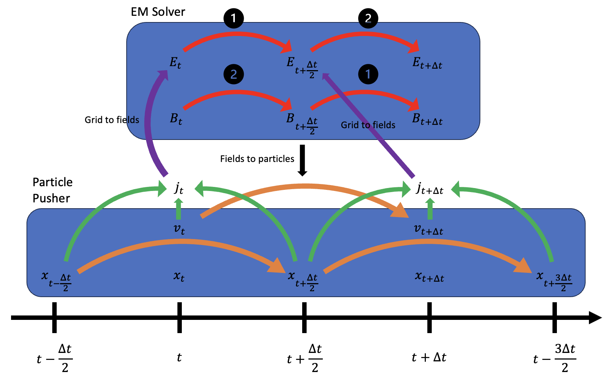
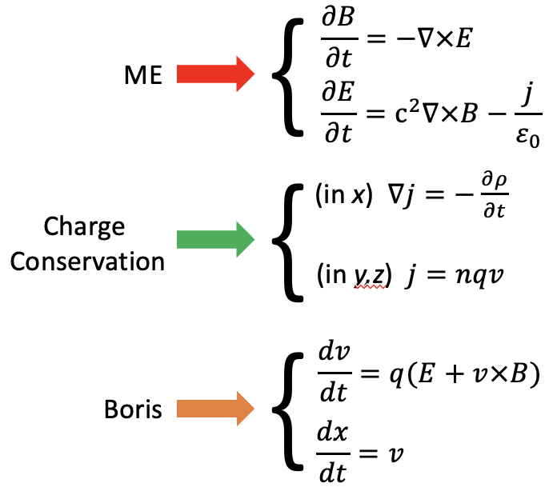
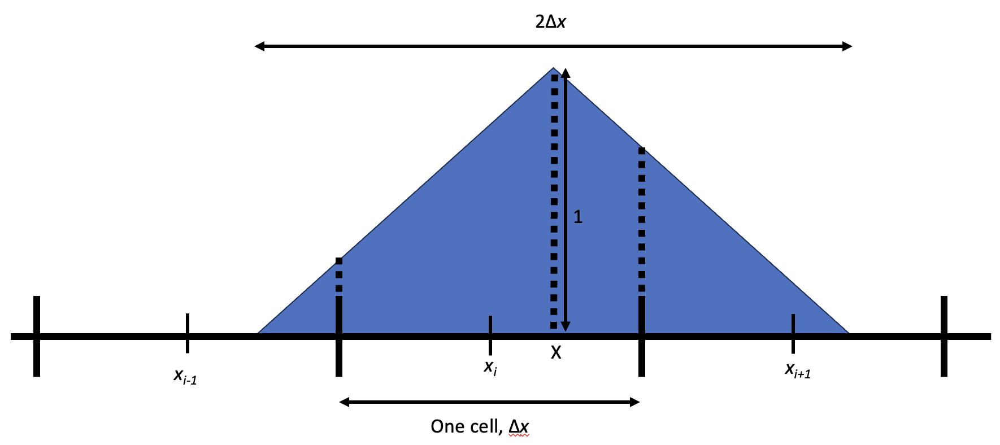
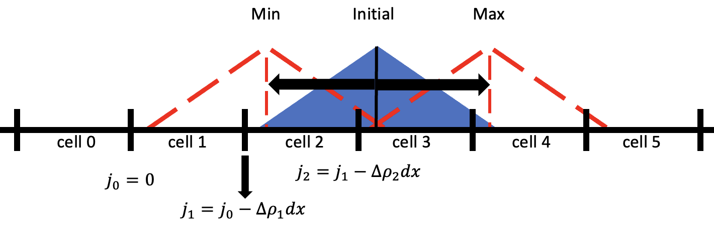
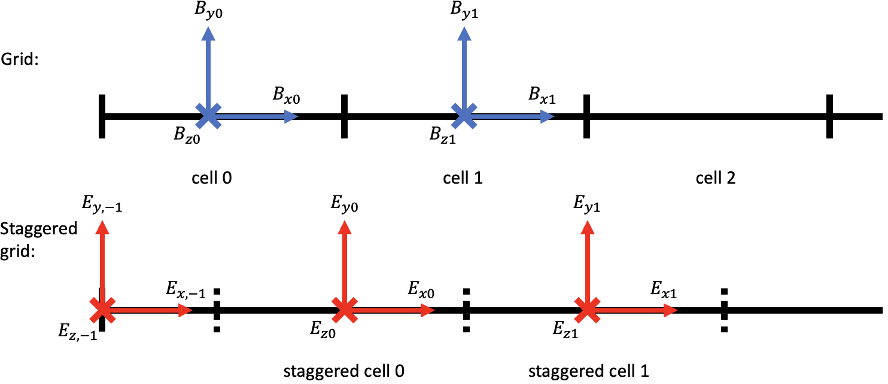
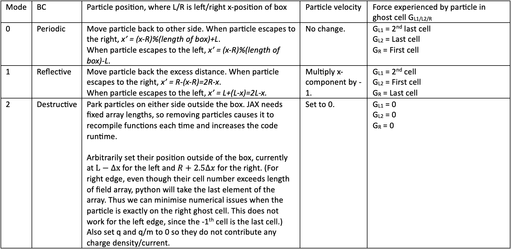
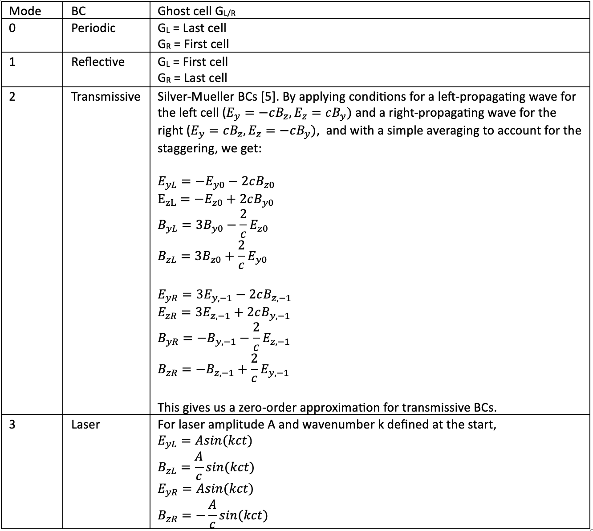

# 1D PiC Code for Simulating Plasmas with Google JAX

**An Imperial College London Undergraduate Research Opportunities Project by Sean Lim, supervised by Dr Aidan Crilly**

JAX enables users to solve multiple equations vectorially (with its vmap function), and compiles code in a GPU-friendly manner, making it very useful in performing Particle-in-Cell simulations efficiently.

## Using the Simulation

### Initialising the Simulation

In the simulation.py module, the main function 'simulation' is called with arguments (steps per snapshot, total steps, ICs, ext_fields,dx,dt,BCs). For neatness, the arguments in simulation are wrapped to be called, and then unwrapped within the simulation function. 

For N particles and M cells,
<ol>
    <li>ICs is an initial conditions sequence containing 3 sequences, (box_size, particle_parameters, fields). 
      <ol>
        <li>box_size contains ($L_x,L_y,L_z$). </li>
        <li>particle_parameters contains (particle positions, velocities, qs, ms, q/ms, number of each pseudospecies, weights).
          <ol>
            <li>Particle positions and velocities should both be an $N\times3$ array.</li>
            <li>Qs,ms and q/ms should all be Nx1 arrays. Note it has to be $N\times1$ and not $N$ to be compatible with JAX's vmap function. Also note the use of $\frac{q}{m}$ to reduce floating point errors as JAX is single-precision.</li>
            <li>number of each pseudospecies should be an iterable of the number of each pseudospecies, e.g. if I had 5000 electrons and 1000 protons, it would be (5000,1000)</li>
            <li>weights should be an integer/float
          </ol>
        </li>
        <li> fields contains (array of E-fields,array of B-fields) where both are $M\times3$ arrays specifying initial E- and B- fields. In EM_solver.py there is a function, find_E0_by_matrix to help check if the initial conditions are correct (this may provide the wrong answer by a constant, hence it is recommended to manually calculate the E-field values). </li>
      </ol>
    </li>
    <li>ext_fields contains (array of E-fields,array of B-fields) where both are $M\times3$ arrays specifying external E- and B- fields.

Note the staggered grid when dealing with E-fields, which are defined on the edges of cells.

Some precautions: dx should be on the order of Debye length to avoid numerical heating. Make functions as smooth as possible, eg for EM waves, apply gaussian envelope or ensure no cutoff of EM waves. For particles, ensure left and right side of system match.

BCs is a 4-integer tuple representing (left particle BC, right particle BC, left field BC, right field BC). Particle BCs are 0 for periodic, 1 for reflective and 2 for destructive. Field BCs are 0 for periodic, 1 for reflective, 2 for trasnsmissive and 3 for laser. Detailed information on how these BCs work can be found below.

If 3 for field BCs is selected, the laser magnitude and wavenumber must be specified with the arguments laser_mag and laser_k (both default 0).

In the Examples folder example_script.py gives a skeleton for the initialisation.

### Output
The simulation supports 2 forms of output, as a returned dictionary variable or by saving files into a folder. This is defined with the write_to_file argument (default false).

For smaller simulations, the code saves all particle $x$-positions and velocities as a $N_t\times N\times3$ array for more flexibility in manipulation, for example for the 2D-histogramming in the 2-stream instability example. The dictionary keys are: 'Time',
'Kinetic Energy','Positions','Velocities','E-fields','E-field Energy','B-fields','B-field Energy','Charge Densities','Temperature' where 'Temperature' returns a $2\times M$ array for the first 2 species.

For larger simulations, the $x$-positions are histogrammed by cell and velocities are histogrammed in 30 bins from $-3v_{rms}$ to $3v_{rms}$. The path to save the files can be defined by the path_to_file argument, default in the current working directory. CSV file names are 'time.csv','kinetic_energy.csv','E_x.csv','E_y.csv','E_z.csv','E_energy_densities.csv','B_x.csv','B_y.csv','B_z.csv','B_energy_densities.csv','chargedens.csv'. For each species there will be a 'species_no_densities.csv', 'species_temp.csv' and 'species_vx_dist.csv'.

## Examples

In the examples folder there are some example simulations showing typical plasma behaviour. Includes plasma oscillations, plasma waves, plasma waves, 2-stream instability, weibel instability, hybrid oscillations.

## Choices Made

The code uses many staples in PiC codes, such as the Boris Algorithm to push particles, a triangular shape function for the pseudoparticles, a staggered Yee Grid for the EM fields, and more. A detailed explanation is given below.

The core of the simulation consists of four parts: 
<ol>
    <li> The particle pusher
    <li> Copying the particles' properties to the grid
    <li> The EM solver
    <li> Returning the EM fields' values to the particles
</ol>

The schematic of one cycle of the simulation is shown:

The Equations to be solved are:

### 1. The Particle Pusher
The particle pusher functions are contained in the particle_mover.py module.

The Boris algorithm staggers the position and velocity in time. The equations used are:
$$v^-=v_t+\frac{q}{m}E_t\frac{\Delta t}{2}$$
$$\frac{v^+-v^-}{\Delta t}=\frac{q}{2m}(v^++v^-)\times B_t$$
$$v_{t+\Delta t}=v^++\frac{q}{m}E_t\frac{\Delta t}{2}$$
This was taken from [1].

To solve the second equation, if $P=P\times Q + R$, then $P=\frac{R+R\times Q+(Q\cdot R)Q}{1+Q\cdot Q}$ [2]. Applying this to our equations gives us $Q=\frac{q\Delta t}{2m}B_t$ and $R=v^-+\frac{q\Delta t}{2m}(v^-\times B_t)$.

### 2. Particles to Grid
These functions are contained in the particles_to_grid.py module.

Particles are taken as pseudoparticles with a weight $\Omega$ such that number density $n=\frac{N_{p}\Omega}{L}$ where $N_{p}$ is the number of pseudoparticles. This is in agreement with the 1D grid, where $\Omega$ carries an 'areal weight' on top of a normal weight (units of no. of actual particles/ $m^2$ ). The pseudoparticles have a triangular shape function of width $2\Delta x$, as used in EPOCH [3]. This smooths out the properties on the grid to reduce numerical noise.

. 

Thus when copying particle charges onto the grid, the charge density is:

-For $|X-x_i|\leq\frac{\Delta x}{2}$ (left and right sides of particle), $\rho=\frac{q}{\Delta x}\left(\frac{3}{4}-\frac{(X-x_i)^2}{\Delta x^2}\right)$.

-For $\frac{\Delta x}{2}\leq|X-x_i|\leq\frac{3\Delta x}{2}$ (centre of particle), $\rho = \frac{q}{2\Delta x}\left(\frac{3}{2}-\frac{|X-x_i|}{\Delta x}\right)^2$.

-For $\frac{3\Delta x}{2}\geq|X-x_i|$ (outside $2\Delta x$), $\rho=0$.

The current density is found using the equation $\frac{\partial j}{\partial x} = -\frac{\partial\rho}{\partial t}$, as in Villasenor and Buneman [4] and EPOCH [5]. This is done by sweeping the grid from left to right. In one timestep, each particle can travel at most 1 cell (since the simulation becomes unstable as $\frac{dx}{dt}\to3\times10^8$), so with the shape function, we only need to sweep between -3 to 2 spaces from the particle's initial cell, where the first cell is empty as the starting point for the sweeping.

The current in y and z direction use $j=nqv$, or more precisely $j=N_p\rho v$.

### 3. The EM solver
The EM solver is contained in the EM_solver.py module.A staggered Yee grid is used, where E-fields are defined on right-side cell edges and B-fields are defined on cell centres. 

The equations to solve are $Ampere$ and $Faraday$. We do not solve Gauss' Law directly, as Poisson solvers can lead to numerical issues, and Gauss' Law is automatically obeyed if we use the charge conservation equation, provided Gauss' Law was satisfied at the start.

In a 1D PiC code, $\frac{dE}{dt} = \nabla\times B$ and $\frac{dB}{dt} = \nabla\times E$ solve transverse EM wave components, while $j_x$ updates longitudinal E-field, and $j_y$ and $j_z$ feed into the equations to create EM waves.

The solver takes 2 steps of $\frac{dt}{2}$ each, first updating the E-field before the B-field, then vice versa. 

### 4. Fields to Particles
The function to return the fields to the particles is found in the particle_mover.py module. Taking into account the particle spanning several cells due to its shape, the total force it experiences adding each part is, where $i$ is the particle cell number, $x_i$ is the ith cell's $x$-position, and $X$ is the particle's $x$-position, 
$$F_{on part} = \frac{1}{2}F_{i-1}\left(\frac{1}{2}+\frac{x_i-X}{\Delta x}\right)^2 + F_{i}\left(\frac{3}{4}-\frac{(x_i-X)^2}{\Delta x^2}\right) + \frac{1}{2}F_{i+1}\left(\frac{1}{2}-\frac{x_i-X}{\Delta x}\right)^2$$ [3].
Note that in the code, the indeces of the the forces are shifted by 1 due to the ghost cells.

### Boundary Conditions
Boundary conditions are found in the boundary_conditions.py module.

Boundary conditions are specified by moving the particles and changing their velocities as desired after they have left the box, and applying ghost cells for fields.

Boundary conditions are also specified to find charge densities based on chosen particle BCs. Note the method of these calculations differ from the above charge density calculations as they use changing $X$ position rather than changing grid cell position.

The code supports 3 particle BC modes, and 3 field BC modes, to be specified on each side. They are displayed in this table :
Particle table:

| Mode | BC | Particle position, where L/R is left/right x-position of box	| Particle velocity |	Force experienced by particle in ghost cells GL1/GL2/GR|
|---|---|---|---|---|
| 0 | Periodic | Move particle back to other side of box. This is done with the modulo function. When particle escapes to the right, x’ = (x-R)%(length of box)+L. When particle escapes to the left, x’ = (x-R)%(length of box)-L. | No change. | GL1 = 2nd last cell   GL2 = Last cell   GR = First cell |
| 1 | Reflective | Move particle back the excess distance. When particle escapes to the right, x’ = R-(x-R)=2R-x. When particle escapes to the left, x’ = L+(L-x)=2L-x. | Multiply x-component by -1. | GL1 = 2nd cell   GL2 = First cell   GR = Last cell |
| 2 | Destructive | Park particles on either side outside the box. JAX needs fixed array lengths, so removing particles causes it to recompile functions each time and increases the code runtime.   Arbitrarily set their position outside of the box, currently at L-Δx for the left and R+2.5Δx for the right. (When calling jnp.arange to produce the grid, the elements towards the end start producing some numerical deviation, parking the particle exactly on the next ghost cell produces some issues. However, python will take the last element of the array even though their cell number exceeds length of field array. Thus we can park the particle a few $\Delta x$'s away.)   Also set q and q/m to 0 so they do not contribute any charge density/current. | Set to 0. | GL1 = 0   GL2 = 0   GR = 0 |

Note the need to use 2 ghost cells on the left due to the leftmost edges of particles in the first half cell undefined when using the staggered grid  while finding E-field experienced.
Note y and z BCs are always periodic.

Field table:

| Mode | BC | Ghost cells GL/GR|
|---|---|---|
| 0 | Periodic | GL = Last cell   GR = First cell |
| 1 | Reflective | GL = First cell   GR = Last cell |
| 2 | Transmissive | Silver-Mueller BCs [5]. By applying conditions for a left-propagating wave for the left cell (E_y=-cB_z,E_z=cB_y) and a right-propagating wave for the right (E_y=cB_z,E_z=-cB_y),  and with a simple averaging to account for the staggering, we get:   $E_{yL}=-E_{y0}-2cB_{z0}$   $E_{zL}=-E_{z0}+2cB_{y0}$   $B_{yL}=3B_{y0}-\frac{2}{c}E_{z0}$   $B_{zL}=3B_{z0}+\frac{2}{c}E_{y0}$     $E_{yR}=3E_{y,-1}-2cB_{z,-1}$   $E_{zR}=3E_{z,-1}+2cB_{y,-1}$   $B_{yR}=-B_{y,-1}-\frac{2}{c}E_{z,-1}$   $B_{zR}= -B_{z,-1}+\frac{2}{c}E_{y,-1}$     This gives us a zero-order approximation for transmissive BCs. |
| 3 | Laser | For laser amplitude A and wavenumber k defined at the start,   $E_{yL}=Asin(kct)$   $B_{zL}=\frac{A}{c} sin(kct)$   $E_{yR}=Asin(kct)$   $B_{zR}=-\frac{A}{c} sin(kct)$ |

### Diagnostics
Apart from the core solver, there is an additional diagnostics.py module for returning useful output. In it are functions to find the system's total kinetic energy, E-field density, B-field density, temperature at each cell and velocity histogram. These are returned in the output.

### The simulation.py module
Finally, the simulation.py module puts it all together. It defines one step in the cycle, which is called in an n_cycles function so we can take many steps before performing diagnosis for long simulations where timescales of phenomenon are much longer than the dt required to maintain stability ($\frac{dx}{dt}<3\times10^8$). 

This outermost function n_cycles, as well as any other outermost functions in the simulation function, are decorated with @jit for jax to compile the function and any other function called inside it, as well as block_until_ready statements placed where necessary to run on GPUs. 

# References
[1] H. Qin, S. Zhang, J. Xiao, J. Liu, Y. Sun, W. M. Tang (2013, August). "Why is Boris algorithm so good. Physics of Plasmas [Online]. vol. 20, issue 8. Available: https://doi.org/10.1063/1.4818428.

[2] That slideshow griffin gave

[3] C. Brady, K. Bennett, H. Schmitz, C. Ridgers (2021, June). Section 4.3.1 "Particle Shape Functions" in "Developers Manual for the EPOCH PIC Codes." Version 4.17.0. Latest version available: https://github.com/Warwick-Plasma/EPOCH_manuals/releases.

[4] J. Villasenor, O. Buneman (1992, March). "Rigorous charge conservation for local electromagnetic field solvers." Computer Physics Communications [Online]. vol. 69, issues 2–3, pages 306-316. Available: https://doi.org/10.1016/0010-4655(92)90169-Y.

[5] C. Brady, K. Bennett, H. Schmitz, C. Ridgers (2021, June). Section 4.3.2 "Current Calculation" in "Developers Manual for the EPOCH PIC Codes." Version 4.17.0. Latest version available: https://github.com/Warwick-Plasma/EPOCH_manuals/releases.

[6] R. Lehe (2016, June). "Electromagnetic wave propagation in Particle-In-Cell codes." US Particle Accelerator School (USPAS) Summer Session [PowerPoint slides]. slides 18-24. Available: https://people.nscl.msu.edu/~lund/uspas/scs_2016/lec_adv/A1b_EM_Waves.pdf.
